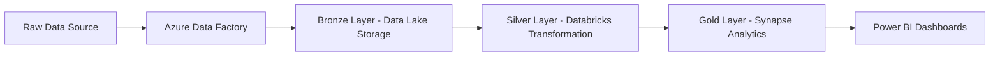
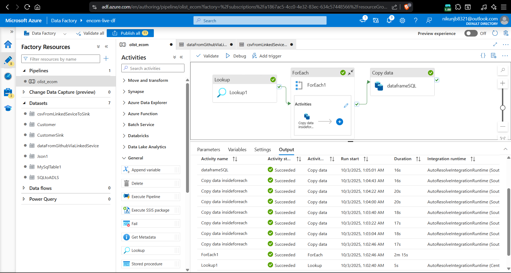
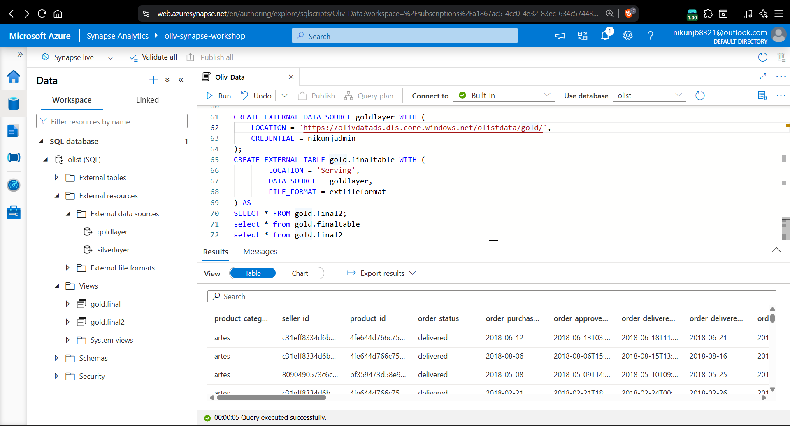
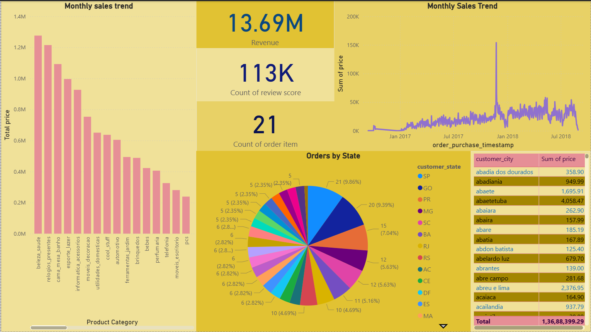

# 🚀 End-to-End Data Pipeline for Olist E-Commerce Data using Azure

---

## 🌟 Project Overview
This project demonstrates an **end-to-end data engineering pipeline** for Olist E-commerce data using **Azure cloud services**.  
The pipeline automates **data ingestion, transformation, and storage**, making it ready for **analytics and business insights**.

---

## 🖼️ Architecture Diagram

---

## 🛠️ Tech Stack
- **Azure Data Factory** – Data ingestion & orchestration  
- **Azure Data Lake Storage (Gen2)** – Raw & processed data storage  
- **Azure Databricks (PySpark)** – Data cleaning & transformation  
- **Azure Synapse Analytics** – Data warehousing & querying  
- **Power BI** – Optional visualization & dashboards  

---

## 🔄 Pipeline Flow

1. Data Ingestion – ADF pulls raw data into Bronze Layer

2. Data Cleaning & Transformation – Databricks (PySpark) processes data into Silver Layer

3. Data Warehousing – Cleaned data loaded into Gold Layer (Synapse Analytics)

4. Visualization  – Power BI dashboards display insights

## 💡 Key Features

* Fully automated ETL pipeline using Azure services

* Implements Medallion Architecture (Bronze → Silver → Gold)

* Scalable & production-ready cloud pipeline

* Data validation & schema enforcement in Databricks

## 🧠 Skills Learned / Highlights

* Azure Data Engineering (ADF, Databricks, Synapse, ADLS)

* PySpark & SQL for large-scale data processing

* ETL Pipeline Design & Data Warehousing

* Cloud orchestration & Medallion Architecture implementation

## 🎬 Demo / Screenshots

### 🧩 Azure Data Factory Pipeline

### ⚙️ Databricks Data Transformation

### 🧮 Azure Synapse Analytics

### 📊 Power Bi Dashboard

## ⚡ How to Run / Setup
1. Clone the repository
2. Set up Azure Data Lake Storage & Databricks workspace
3. Run Data Factory pipelines
4. Connect Synapse & visualize in Power BI

# 🏆 Conclusion / Outcome

This project demonstrates a real-world, scalable data engineering pipeline, transforming raw e-commerce data into structured, analytics-ready datasets.
It highlights cloud-based ETL, transformation, and warehouse design, showcasing skills required for data engineering roles.

